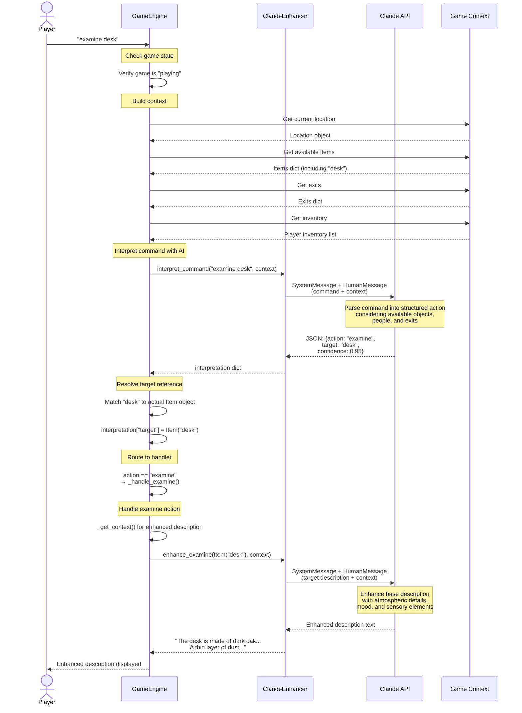

# Command Processing Flow

This document describes the flow of command processing in the PiesPlanos text adventure game engine.

## Example: "examine desk"

The following Mermaid sequence diagram illustrates how the command "examine desk" flows through the system:

## Command Processing Steps

1. **Input Reception** (`engine.py:88-91`)
   - Player enters command
   - GameEngine validates game state is "playing"

2. **Context Building** (`engine.py:93-97`)
   - Retrieves current location
   - Gathers available items in location
   - Collects exit information
   - Gets player inventory
   - Packages context via `_get_context()`

3. **AI Command Interpretation** (`models/ai_enhancer.py:182-250`)
   - `ClaudeEnhancer.interpret_command()` is called
   - Sends command + context to Claude API
   - Claude parses natural language into structured action
   - Returns JSON with: action, target, recipient (optional), message (optional), confidence

4. **Target Resolution** (`engine.py:104-121`)
   - Maps string target names to actual game objects
   - Checks items, exits, NPCs, and location
   - Updates interpretation dict with object references

5. **Action Routing** (`engine.py:123-137`)
   - Routes to appropriate handler based on action type
   - Supported actions: examine, say, ask, talk, move, inventory

6. **Examine Handler** (`engine.py:139-144`)
   - Calls `ai_enhancer.enhance_examine()` with target and context
   - AI enhances base description with atmospheric details
   - Returns enhanced description to player

## Key Components

- **GameEngine** (`engine.py`): Main orchestrator
- **ClaudeEnhancer** (`models/ai_enhancer.py`): AI enhancement service
- **Context**: Location, items, exits, inventory, investigation progress
- **Item/Location/NPC Objects** (`models/models.py`): Game entities with base descriptions

## AI Enhancement Points

1. **Command Interpretation**: Natural language → structured action
2. **Description Enhancement**: Base description → atmospheric narrative
3. **NPC Responses**: Personality-driven dialogue generation
4. **Action Results**: Enhanced action outcome descriptions
