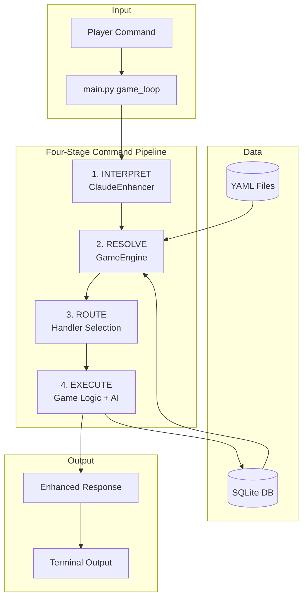
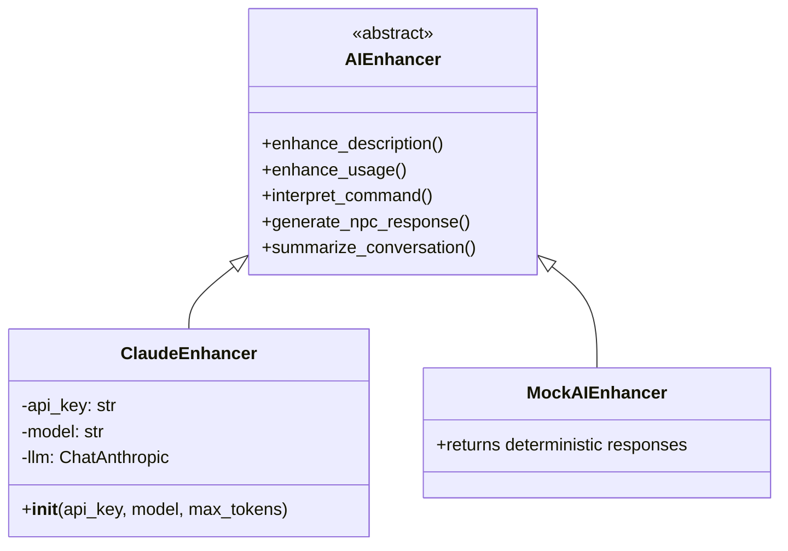
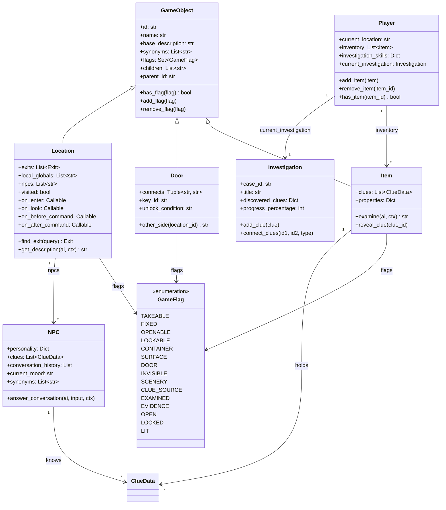
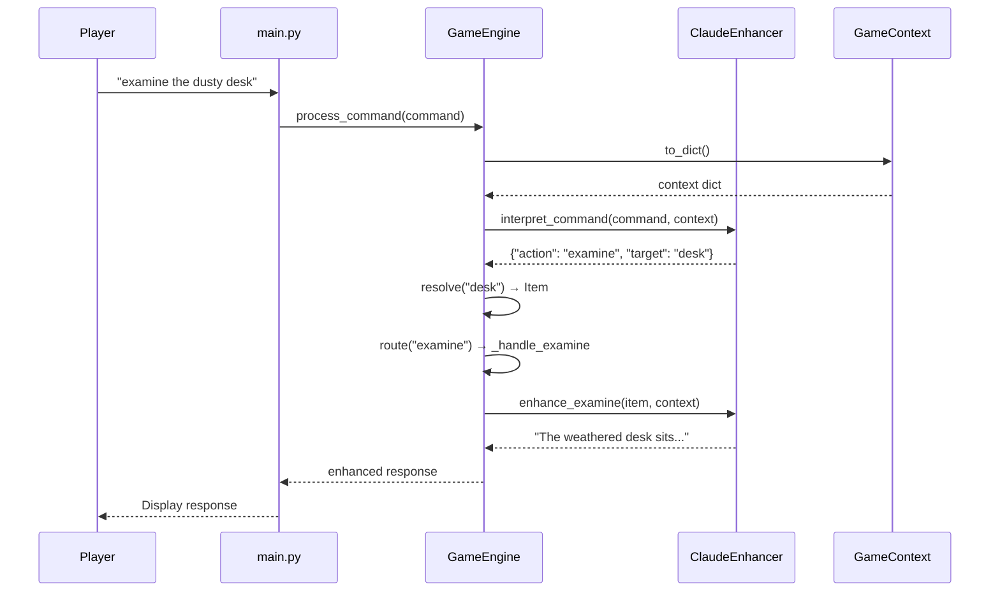
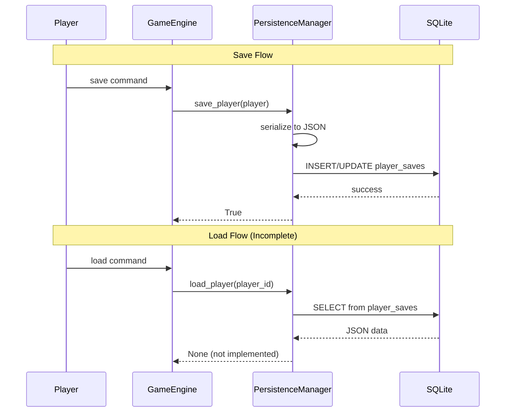
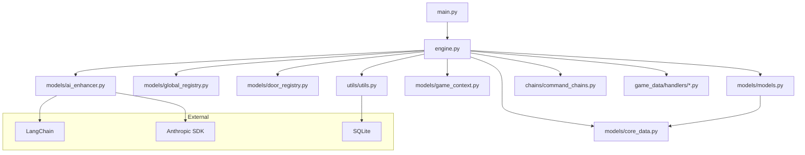

# Pies Planos - Architecture

> Technical architecture documentation for the GUMSHOE-style detective text adventure game.

---

## System Overview



---

## Core Components

### 1. GameEngine (`src/engine.py`)

The orchestrator that manages the entire command processing pipeline.

**Responsibilities**:
- Load game content from YAML files
- Load GlobalRegistry (globals.yaml) and DoorRegistry (doors.yaml)
- Auto-load Python handler files from `game_data/handlers/`
- Process commands through the 4-stage pipeline
- Manage game state (locations, items, NPCs)
- Coordinate AI enhancement calls
- Handle save/load operations

**Key Methods**:
```python
load_game_content(content_path)      # Load YAML files + registries + handlers
start_new_game(player_name, case_id) # Initialize new game
process_command(command: str) → str   # Main command handler
_resolve_object(query: str)           # 6-step object resolution
_handle_examine(interpretation)       # Examine objects/NPCs/doors
_handle_talk(interpretation)          # NPC conversations (placeholder)
_handle_move(interpretation)          # Location transitions + door checks
_handle_inventory()                   # Show inventory
save_game()                           # Persist to SQLite
```

### 2. AI Enhancer (`src/models/ai_enhancer.py`)

Abstract interface with implementations for AI-powered features.



**ClaudeEnhancer** (Production):
- Uses `claude-3-haiku-20240307` by default
- `interpret_command()` - NLP to structured JSON
- `enhance_examine()` - Atmospheric descriptions
- `generate_npc_response()` - Personality-driven dialogue

**MockAIEnhancer** (Testing):
- Deterministic responses
- No API calls
- Enables isolated unit tests

### 3. Game Models (`src/models/models.py` + `src/models/core_data.py`)



### 4. Game Context (`src/models/game_context.py`)

Encapsulates current game state for AI calls.

**Properties** (lazy-loaded, cached):
- `current_location` - Player's current Location
- `available_items` - Room items + inventory
- `npcs` - NPCs in current location
- `exits` - Available movement options
- `investigation_progress` - Percentage complete

**Caching Strategy**:
```
First access → Load from GameEngine → Cache
Subsequent access → Return cached value
State change → invalidate() → Clear cache
```

---

## Data Flow

### Command Processing Pipeline



### Save/Load Flow



---

## Key Design Decisions

### 1. Four-Stage Pipeline (Non-Negotiable)

**Context**: Need to process natural language while maintaining deterministic game behavior.

**Options Considered**:
1. Direct AI control - Let AI handle everything
2. Keyword parsing - Traditional text adventure style
3. Hybrid pipeline - AI interprets, engine executes

**Decision**: Hybrid pipeline (Option 3)

**Reasons**:
- AI handles language ambiguity ("the dusty desk" → "desk")
- Engine maintains game integrity (AI can't cheat)
- Clear separation of concerns
- Testable (mock AI returns consistent JSON)

**Trade-off**: More complex routing logic, but predictable behavior.

### 2. AI Enhancement Boundaries

**Context**: AI should make the game atmospheric without breaking mechanics.

**Decision**: AI CAN enhance descriptions, CANNOT alter game state.

**Enforcement**:
- System prompts explicitly forbid state changes
- Handlers call AI for text only, not decisions
- Clue discovery determined by YAML + game logic

**Trade-off**: Less AI freedom, but game balance preserved.

### 3. YAML Content Authority

**Context**: Need to easily create new game scenarios.

**Decision**: All game content in YAML files, not Python code.

**Structure**:
```
game_data/files/
├── locations.yaml   # Rooms: descriptions, exits, children, local_globals
├── items.yaml       # Objects: flags, synonyms, clues, properties
├── npcs.yaml        # Characters: personality, clues, synonyms
├── clues.yaml       # Investigation clues and connections
├── doors.yaml       # Shared door objects (visible from two rooms)
└── globals.yaml     # Global objects + local-globals (ambient scenery)
```

**Trade-off**: YAML validation needed, but content creation doesn't require coding.

### 4. SQLite Persistence

**Context**: Need to save player progress and NPC conversations.

**Decision**: SQLite with JSON serialization.

**Schema**:
```sql
player_saves (player_id, save_data JSON, last_modified)
npc_conversations (player_id, npc_id, conversation_data, last_modified)
```

**Trade-off**: Object reconstruction from JSON not yet implemented.

### 5. Lazy Context Caching

**Context**: AI calls need game state context, but building it is expensive.

**Decision**: Lazy-load and cache GameContext until invalidated.

**Trade-off**: Must remember to call `_invalidate_context()` after state changes.

---

## Module Dependencies



---

## Error Handling Strategy

1. **AI Errors**: `_safe_invoke()` catches exceptions, returns `[AI unavailable: error]`
2. **Parsing Errors**: Fall back to `examine room` if JSON parsing fails
3. **Resolution Errors**: Return "I don't see that here" messages
4. **Save Errors**: Return False, log error, don't crash game

---

## Extension Points

### Adding New Commands

1. Add action type to `interpret_command()` system prompt
2. Create `_handle_<action>()` method in GameEngine — use `_resolve_object()` for target resolution
3. Add routing in `process_command()` switch
4. Update tests

### Adding New Game Content

1. Create/edit YAML files in `game_data/files/`
2. Add scenario entry in `game_cards.yaml`
3. No Python changes needed

### Adding Location Logic (Hooks)

1. Create `game_data/handlers/<location_id>.py`
2. Implement any of: `on_enter`, `on_look`, `on_before_command`, `on_after_command`
3. Engine auto-loads on startup — no registration needed

### Adding New AI Enhancer

1. Extend `AIEnhancer` abstract class
2. Implement all abstract methods
3. Inject into GameEngine constructor

---

## Performance Considerations

- **Context Caching**: Avoids repeated queries per command
- **Conversation Summarization**: Compresses history >50 entries
- **Lazy Loading**: YAML loaded once at game start
- **Fuzzy Matching**: Bounded by current location items only

---

## Security Notes

- API keys loaded from `.env`, never committed
- No user input directly executed
- SQLite parameterized queries prevent injection
- AI responses sanitized before display

---

*Architecture last updated: March 2026*
