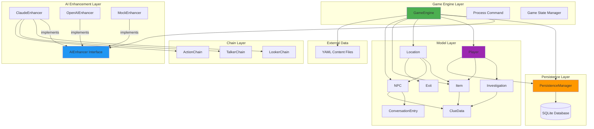
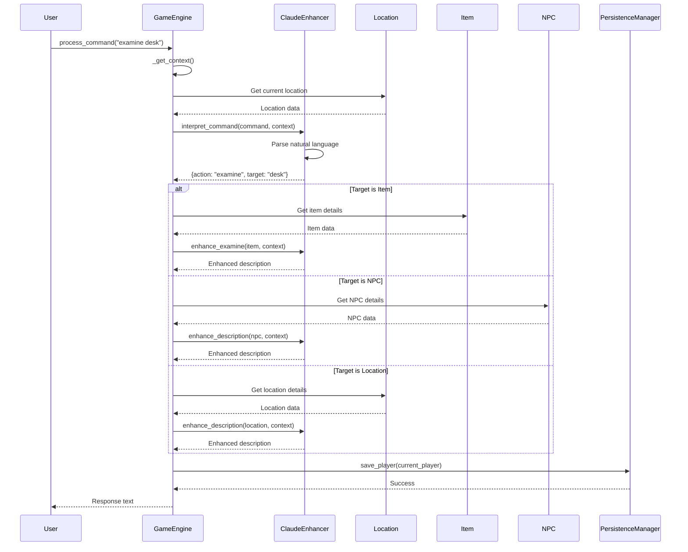
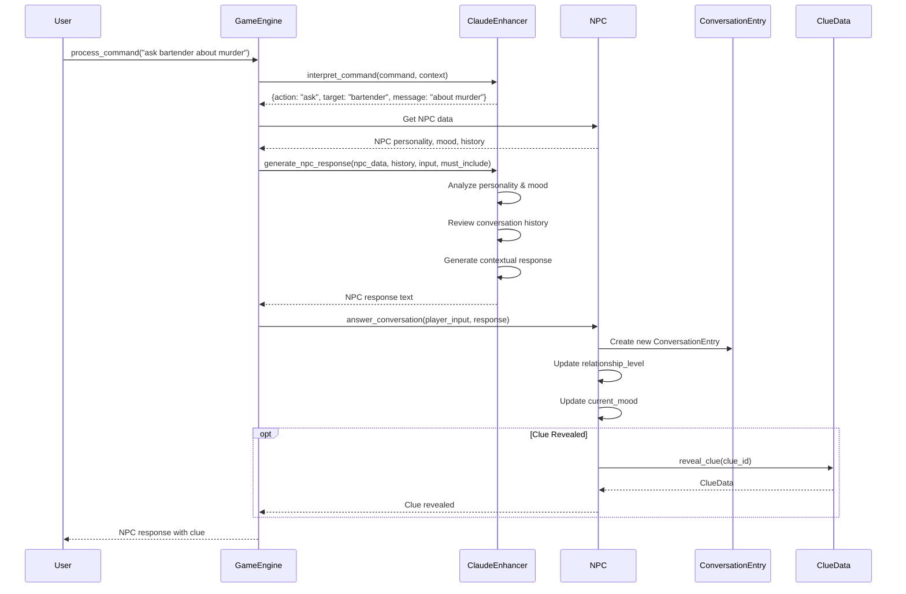
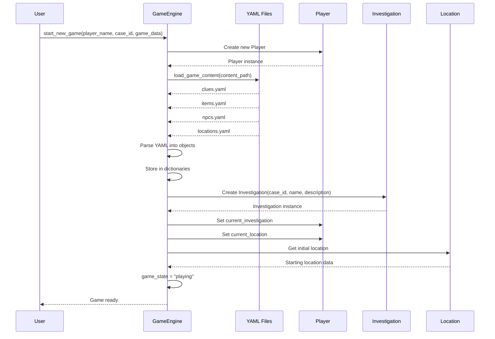
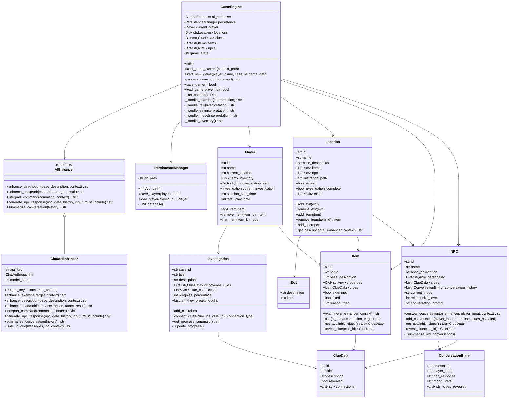
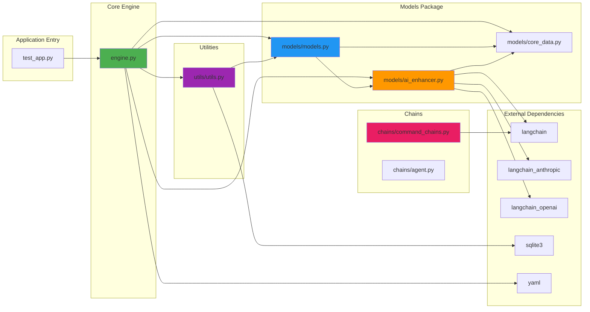
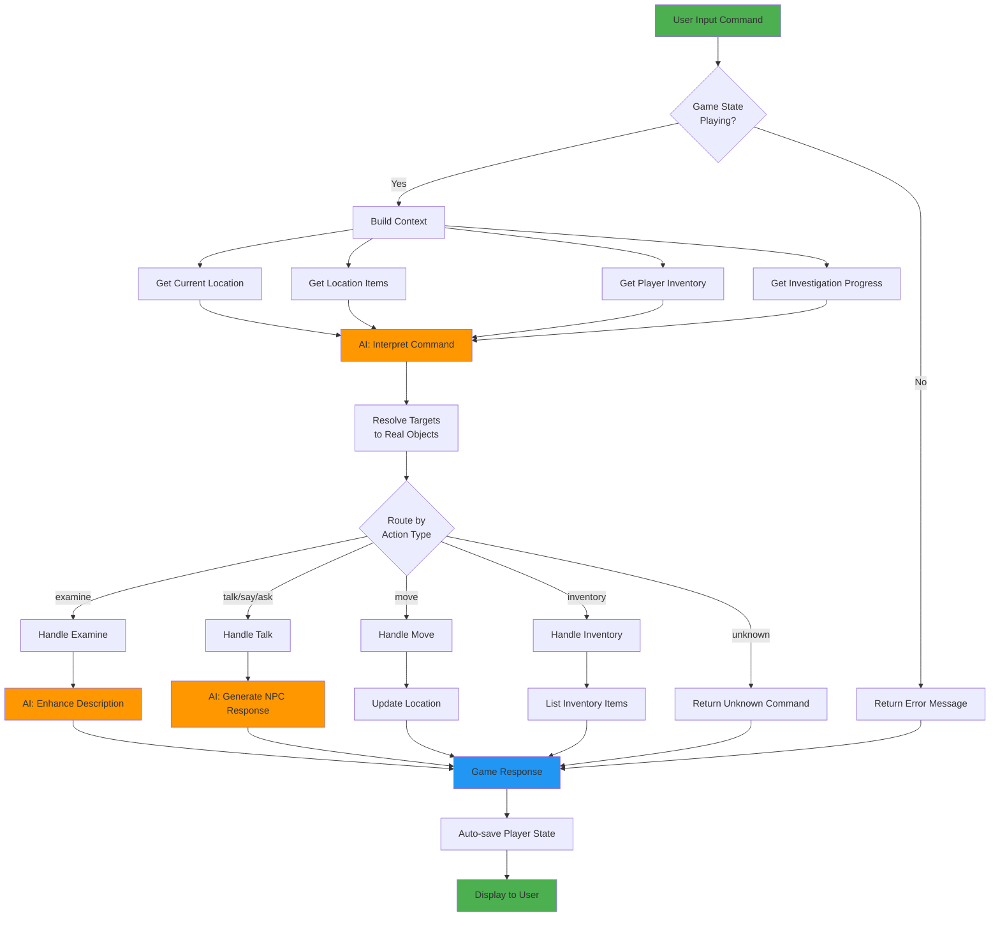
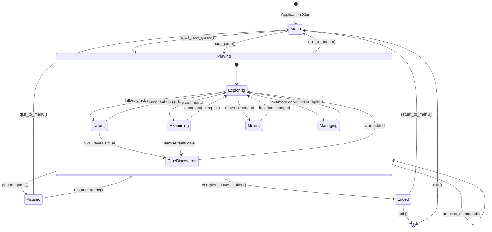
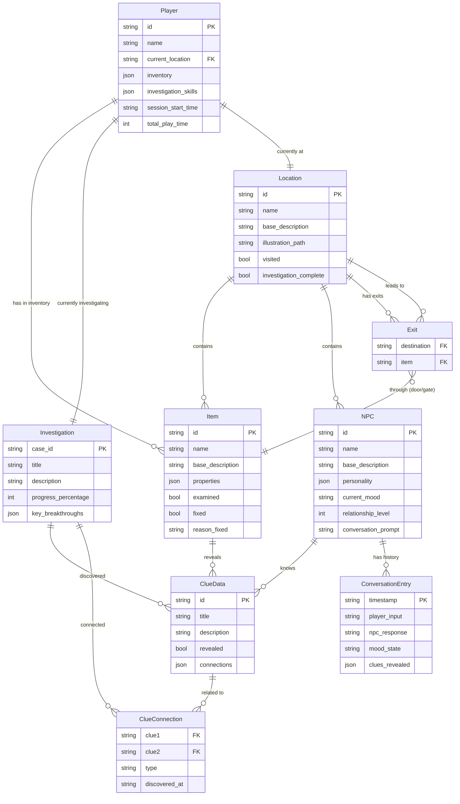

# Architecture and Design Diagrams

## Architecture/Component Diagram

### Explanation

This diagram shows the high-level architecture of the AI-Enhanced Investigation Text Adventure Game, organized into distinct layers:

**Main Components:**
- **Game Engine Layer**: The central `GameEngine` orchestrates all game operations, command processing, and state management
- **AI Enhancement Layer**: An abstract `AIEnhancer` interface with three concrete implementations (Claude, OpenAI, Mock) for flexible AI provider switching
- **Model Layer**: Core game entities including Player, Location, Item, NPC, Investigation, and supporting data structures
- **Persistence Layer**: `PersistenceManager` handles save/load operations via SQLite database
- **Chain Layer**: LangChain-based components for specialized AI operations (looking, talking, actions)
- **External Data**: YAML files provide game content configuration

**Key Relationships:**
- GameEngine depends on all major subsystems and coordinates their interactions
- AI implementations follow the interface pattern (shown as `-->|implements|`), allowing runtime flexibility
- Model objects form a rich domain model with interconnected relationships
- ClaudeEnhancer uses specialized chains for enhanced AI processing

---

## Call Flow/Sequence Diagram - Command Processing

### Explanation

This sequence diagram illustrates the complete flow of processing a player command from input to response:

**Main Flow:**
1. **Command Reception**: User inputs a natural language command (e.g., "examine desk")
2. **Context Building**: GameEngine gathers current game state including location, items, and player status
3. **AI Interpretation**: ClaudeEnhancer parses the natural language into structured action/target pairs
4. **Target Resolution**: GameEngine resolves the target string to actual game objects (Item, NPC, or Location)
5. **AI Enhancement**: Based on target type, appropriate AI enhancement generates rich, contextual descriptions
6. **Persistence**: Player state is automatically saved after each command
7. **Response Delivery**: Enhanced description is returned to the user

**Key Decision Points:**
- The `alt` block shows how different target types (Item, NPC, Location) route to different enhancement methods
- Each path retrieves specific object details and applies contextually appropriate AI enhancement
- The system maintains consistency by always saving state before responding

---

## Call Flow/Sequence Diagram - NPC Conversation

### Explanation

This diagram shows the sophisticated NPC conversation system powered by AI:

**Conversation Flow:**
1. **Command Interpretation**: Natural language query is parsed to extract the target NPC and conversation topic
2. **NPC State Retrieval**: GameEngine fetches NPC's personality traits, current mood, relationship level, and conversation history
3. **AI Response Generation**: ClaudeEnhancer generates a contextual response considering:
   - NPC personality and character traits
   - Current emotional state (mood)
   - Relationship with player (friendly, neutral, hostile)
   - Previous conversation context
   - Required information to include (clues, plot points)
4. **State Updates**: The NPC updates its internal state based on the conversation:
   - Creates a `ConversationEntry` with timestamp and content
   - Adjusts `relationship_level` based on interaction quality
   - Updates `current_mood` based on conversation tone
5. **Clue Discovery**: Optionally, if conditions are met, the NPC reveals a clue that advances the investigation

**Key Features:**
- Stateful conversations with memory
- Dynamic NPC personalities that evolve
- Investigation progression through dialogue
- Contextually aware AI responses

---

## Call Flow/Sequence Diagram - Game Initialization

### Explanation

This sequence shows the complete game initialization process:

**Initialization Steps:**
1. **Player Creation**: A new Player object is instantiated with unique ID and name
2. **Content Loading**: GameEngine loads all game content from YAML files:
   - `clues.yaml`: Investigation clues and their connections
   - `items.yaml`: Interactive objects with properties and associated clues
   - `npcs.yaml`: Non-player characters with personalities and dialogue
   - `locations.yaml`: Game world locations with descriptions and connections
3. **Object Construction**: YAML data is parsed and converted into domain objects (Item, NPC, Location, ClueData instances)
4. **Data Storage**: Objects are stored in dictionaries indexed by ID for fast lookup
5. **Investigation Setup**: An Investigation object is created for the specific case/scenario
6. **Player Configuration**: Player is linked to their investigation and placed at the starting location
7. **State Transition**: Game state changes from "menu" to "playing"

**Design Benefits:**
- Content-driven design allows easy scenario creation
- Separation of game logic from game content
- YAML files enable non-programmer content creation
- All game entities are loaded and ready before gameplay begins

---

## Class Diagram

### Explanation

This comprehensive class diagram shows all major classes and their relationships:

**Core Classes:**

- **GameEngine**: The central orchestrator that manages game state, processes commands, and coordinates all subsystems. It maintains dictionaries of all game entities for efficient lookup and routing.

- **AIEnhancer (Interface)**: Abstract interface defining the contract for AI services. Supports multiple implementations for flexibility and testing.

- **ClaudeEnhancer**: Concrete implementation using Anthropic's Claude API via LangChain. Provides sophisticated natural language processing, command interpretation, and contextual response generation.

**Game Entities:**

- **Player**: Represents the player character with inventory, skills, current location, and active investigation. Tracks session data and playtime.

- **Location**: Game world locations with items, NPCs, exits, and visual illustrations. Supports AI-enhanced descriptions based on context.

- **Item**: Interactive objects with properties, clues, and usage mechanics. Can be fixed (immovable) or portable. Tracks examination state.

- **NPC**: Non-player characters with personality traits, mood states, relationship levels, and conversation history. Manages clue revelation through dialogue.

- **Investigation**: Tracks overall case progress, discovered clues, clue connections, and key breakthroughs. Calculates completion percentage.

**Supporting Classes:**

- **ClueData**: Represents discoverable investigation clues with connections to other clues for building theories.

- **ConversationEntry**: Records individual dialogue exchanges with timestamps, mood states, and revealed clues.

- **Exit**: Represents connections between locations through items (doors, gates, passages).

- **PersistenceManager**: Handles save/load operations to SQLite database for game state persistence.

**Relationship Patterns:**
- Dependency: GameEngine depends on multiple subsystems (shown with arrows)
- Implementation: ClaudeEnhancer implements the AIEnhancer interface (shown as `-->|implements|`)
- Composition: Player contains Investigation, Items; Location contains Items, NPCs, Exits
- Association: Multiple classes reference ClueData, showing clues are central to the investigation mechanic

---

## Module Dependency Graph

### Explanation

This module dependency graph shows the file-level organization and dependencies:

**Application Structure:**

- **Application Entry** (`test_app.py`): Entry point that initializes and runs the game engine. Contains example usage and testing scenarios.

- **Core Engine** (`engine.py`): Central game engine module. Depends on all other internal modules and coordinates their interactions.

**Package Organization:**

- **Models Package**: Contains three modules:
  - `models.py`: Core game entity classes (Player, Location, Item, NPC, Investigation)
  - `core_data.py`: Supporting data structures (ClueData, ConversationEntry, Exit)
  - `ai_enhancer.py`: AI enhancement interface and implementations (AIEnhancer, ClaudeEnhancer, OpenAIEnhancer, MockEnhancer)

- **Utilities**: `utils.py` contains the PersistenceManager for database operations

- **Chains**: LangChain-based components for specialized AI processing:
  - `command_chains.py`: Command processing chains (LookerChain, TalkerChain, ActionChain)
  - `agent.py`: Additional AI agent functionality

**External Dependencies:**

- **langchain**: Core LangChain framework for building AI chains
- **langchain_anthropic**: Anthropic/Claude integration for LangChain
- **langchain_openai**: OpenAI integration for LangChain
- **sqlite3**: Database for game state persistence
- **yaml**: Configuration file parsing for game content

**Dependency Flow:**
- Clear layered architecture with application → engine → models → data flow
- Models package has internal dependencies (models.py depends on core_data.py and ai_enhancer.py)
- AI module bridges internal code and external LLM services
- Minimal circular dependencies, maintaining clean architecture
- Chains package is independent, used by AI enhancer implementations

---

## Data Flow Diagram - Command to Response

### Explanation

This data flow diagram traces how user input is transformed into game responses:

**Flow Stages:**

1. **Validation Stage**:
   - Checks if game is in "playing" state
   - Rejects commands if game not active (menu, paused, ended states)

2. **Context Building Stage**:
   - Gathers current location data
   - Collects items present in location
   - Retrieves player inventory
   - Fetches investigation progress percentage
   - Creates rich context for AI interpretation

3. **AI Interpretation Stage** (First AI touchpoint):
   - Natural language command is parsed using AI
   - Context informs interpretation accuracy
   - Returns structured action/target/recipient data
   - Outputs confidence score for interpretation quality

4. **Target Resolution Stage**:
   - Converts target strings to actual game objects
   - Maps "desk" → Item instance
   - Maps "bartender" → NPC instance
   - Maps "north" → Exit/Location instance

5. **Action Routing Stage**:
   - Routes to appropriate handler based on action type:
     - `examine`: Visual/sensory descriptions
     - `talk/say/ask`: NPC dialogue
     - `move`: Location transitions
     - `inventory`: Item management
     - `unknown`: Error handling

6. **Action Execution Stage**:
   - **Examine**: AI enhances descriptions with atmosphere and sensory details
   - **Talk**: AI generates contextual NPC responses based on personality/mood
   - **Move**: Updates player location and marks location as visited
   - **Inventory**: Lists items with basic descriptions

7. **Response Assembly Stage**:
   - All paths converge to create game response
   - Response formatted for display

8. **Persistence Stage**:
   - Player state automatically saved after each command
   - Ensures progress is never lost

9. **Display Stage**:
   - Final response delivered to user

**AI Integration Points** (highlighted in orange):
- **AI Interpret**: Command understanding
- **AI Enhance**: Description enrichment
- **AI NPC**: Dialogue generation

This shows how AI is strategically integrated at key decision and content generation points while maintaining a deterministic game state system.

---

## State Diagram - Game States

### Explanation

This state diagram models the game's state machine and player action states:

**Top-Level Game States:**

1. **Menu State**:
   - Entry point when application starts
   - Players can start new game or load saved game
   - Can exit application from here

2. **Playing State**:
   - Active gameplay state (detailed in nested states)
   - Commands are processed continuously
   - Can pause, complete investigation, or quit to menu
   - Self-loops on `process_command()` showing continuous interaction

3. **Paused State**:
   - Game temporarily suspended
   - Can resume to Playing or quit to Menu
   - Useful for mid-game breaks

4. **Ended State**:
   - Investigation completed
   - Can return to Menu or exit application
   - End of gameplay session

**Playing Sub-States** (Nested State Machine):

The Playing state contains its own state machine for player actions:

1. **Exploring** (Default state):
   - Player is in a location, choosing what to do next
   - Entry point for all actions
   - Return point after actions complete

2. **Examining**:
   - Player inspects items, NPCs, or locations
   - Triggered by examine commands
   - Returns to Exploring when complete
   - May transition to ClueDiscovered

3. **Talking**:
   - Player converses with NPCs
   - Triggered by talk/say/ask commands
   - Returns to Exploring when conversation ends
   - May transition to ClueDiscovered if NPC reveals information

4. **Moving**:
   - Player changes location
   - Triggered by movement commands
   - Returns to Exploring in new location

5. **Managing**:
   - Player manages inventory
   - Triggered by inventory commands
   - Returns to Exploring after action

6. **ClueDiscovered** (Transient state):
   - Represents moment of discovery
   - Triggered from Examining or Talking
   - Immediately transitions back to Exploring after clue is added
   - Updates Investigation progress

**Key Patterns:**
- Clear state transitions with labeled trigger events
- Nested states allow fine-grained modeling of gameplay
- All action states return to Exploring (hub pattern)
- ClueDiscovered is a transient state representing events, not persistent states
- Multiple exit points from application (Menu or Ended states)

This state machine ensures the game maintains valid states and prevents impossible transitions.

---

## Entity-Relationship Diagram - Data Model

### Explanation

This entity-relationship diagram models the game's data structure and relationships:

**Core Entities:**

**Player** (Central entity):
- Unique identifier and name
- Links to current Location (one-to-one)
- Links to current Investigation (one-to-one)
- Contains inventory Items (one-to-many)
- Stores investigation skills as JSON (flexibility for different game scenarios)
- Tracks session data and total playtime

**Location** (Game world):
- Contains multiple Items (one-to-many)
- Contains multiple NPCs (one-to-many)
- Has multiple Exits to other Locations (one-to-many)
- Tracks visited status and investigation completion
- Optional illustration path for visual content

**Item** (Interactive objects):
- Can be in Location or Player inventory (many-to-one relationships)
- Reveals multiple ClueData (one-to-many)
- Properties stored as JSON for flexibility (different item types have different attributes)
- Can be "fixed" (immovable) with reason explanation
- Tracks examination state

**NPC** (Non-player characters):
- Resides in Locations (many-to-one)
- Knows multiple ClueData (one-to-many)
- Has multiple ConversationEntries (one-to-many)
- Personality stored as JSON (flexible trait system)
- Tracks mood state and relationship level with player
- Has conversation prompt for AI generation

**Investigation** (Case tracking):
- Linked to Player (one-to-one)
- Tracks discovered ClueData (one-to-many)
- Maintains ClueConnections (one-to-many)
- Calculates progress percentage
- Key breakthroughs stored as JSON list

**Supporting Entities:**

**ClueData** (Investigation clues):
- Can be associated with Items, NPCs, or Investigations
- Participates in ClueConnections (many-to-many through join entity)
- Tracks revelation status
- Connections stored as JSON for flexibility

**ConversationEntry** (Dialogue history):
- Belongs to NPC (many-to-one)
- Timestamped for chronological ordering
- Records mood state at time of conversation
- Tracks which clues were revealed in each exchange

**Exit** (Location connections):
- Links two Locations (many-to-one relationship to destination)
- References an Item (door, gate, passage) through which exit occurs
- Enables navigation graph between locations

**ClueConnection** (Clue relationships):
- Join entity for many-to-many ClueData relationships
- Links two clues with relationship type (related, contradicts, supports)
- Timestamped for investigation timeline

**Cardinality Patterns:**

- `||--||`: One-to-one (Player-Investigation, Player-Location)
- `||--o{`: One-to-many (Location-Items, NPC-ConversationEntries)
- `}o--||`: Many-to-one (Exit-Location, Item-Location)

**Design Highlights:**

1. **Flexibility**: JSON fields allow different game scenarios without schema changes
2. **Investigation Mechanics**: ClueData and ClueConnection support complex investigation graphs
3. **Dialogue System**: ConversationEntry enables stateful, evolving NPC relationships
4. **World Structure**: Location-Exit-Item relationship creates navigable game world
5. **State Tracking**: Boolean flags (visited, examined, revealed) enable state-dependent gameplay
6. **Temporal Data**: Timestamps enable replay, analytics, and chronological ordering

This data model supports the core investigation gameplay loop: explore locations, examine items, talk to NPCs, discover clues, make connections, and solve the case.
