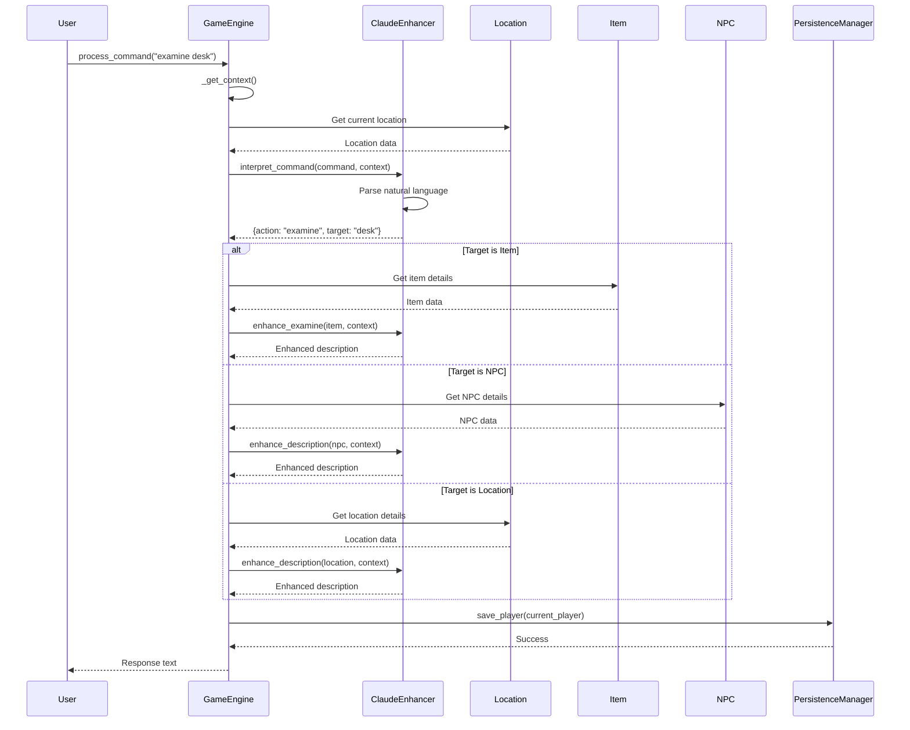
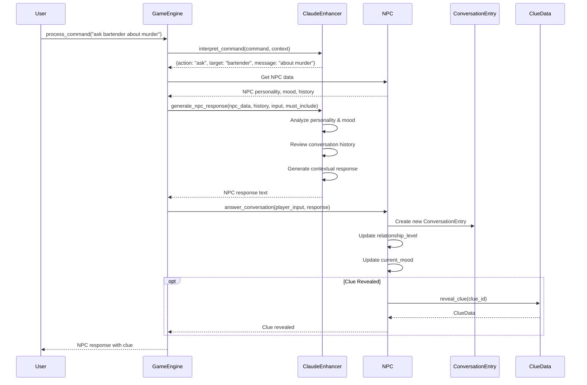
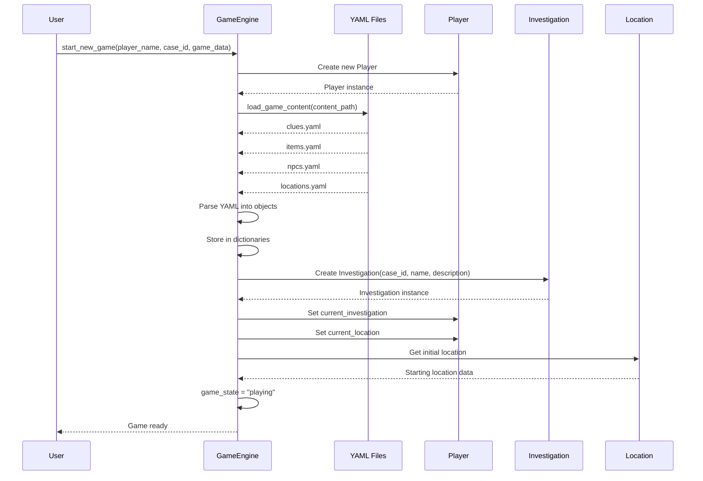
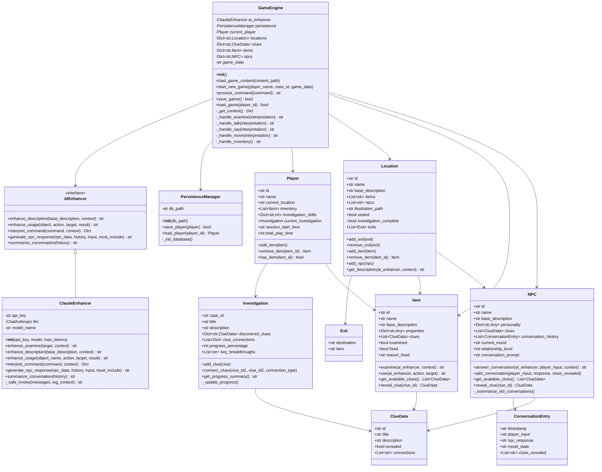
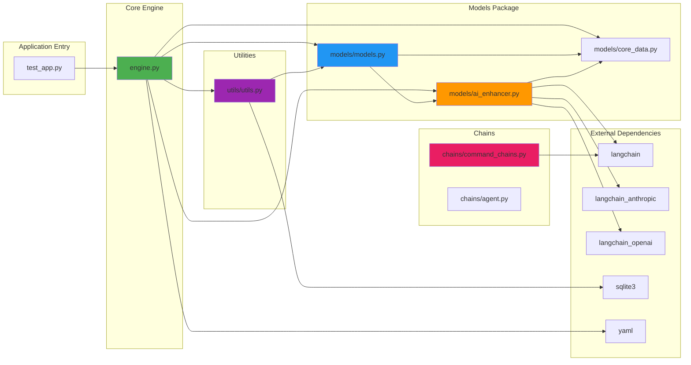
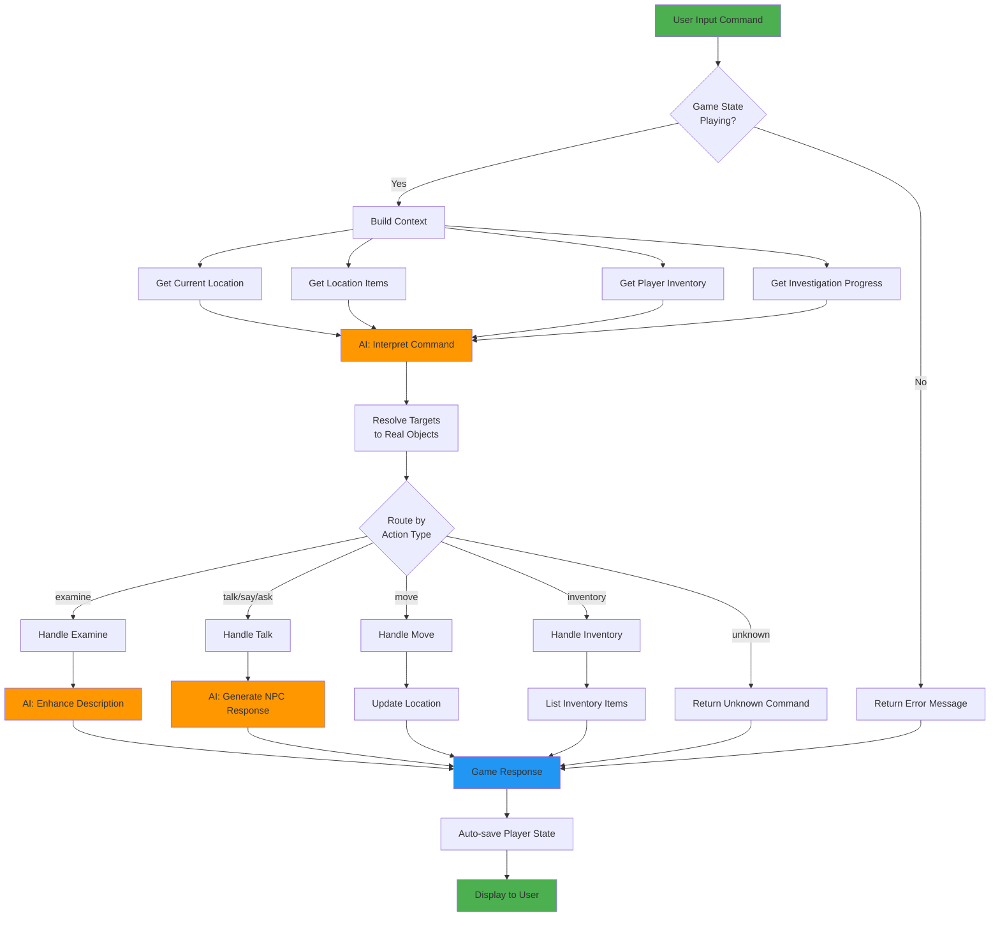
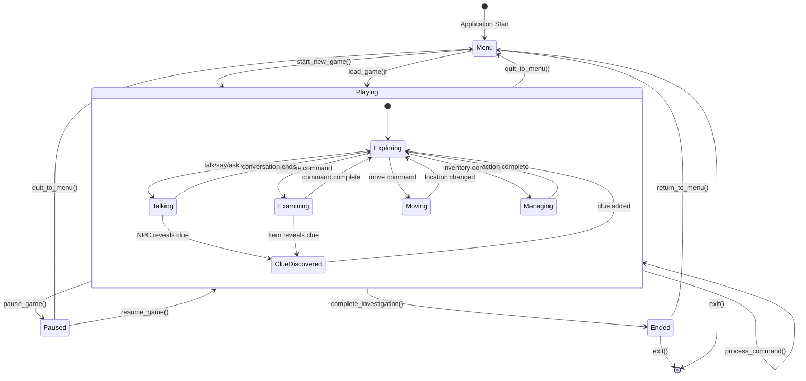
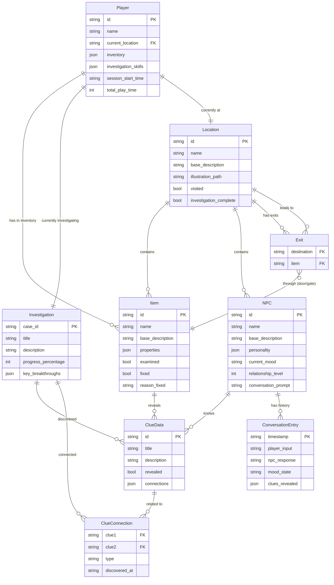

# Architecture and Design Diagrams

## Architecture/Component Diagram

```mermaid
graph TB
    subgraph "Game Engine Layer"
        GE[GameEngine]
        PC[Process Command]
        GS[Game State Manager]
    end

    subgraph "AI Enhancement Layer"
        AIE[AIEnhancer Interface]
        CE[ClaudeEnhancer]
        OE[OpenAIEnhancer]
        ME[MockEnhancer]
    end

    subgraph "Model Layer"
        Player[Player]
        Location[Location]
        Item[Item]
        NPC[NPC]
        Investigation[Investigation]
        ClueData[ClueData]
        ConversationEntry[ConversationEntry]
        Exit[Exit]
    end

    subgraph "Persistence Layer"
        PM[PersistenceManager]
        DB[(SQLite Database)]
    end

    subgraph "Chain Layer"
        LC[LookerChain]
        TC[TalkerChain]
        AC[ActionChain]
    end

    subgraph "External Data"
        YAML[YAML Content Files]
    end

    GE --> AIE
    GE --> PM
    GE --> Player
    GE --> Location
    GE --> Item
    GE --> NPC
    GE --> YAML

    AIE <|-- CE
    AIE <|-- OE
    AIE <|-- ME

    CE --> LC
    CE --> TC
    CE --> AC

    Player --> Investigation
    Player --> Item
    Location --> Item
    Location --> NPC
    Location --> Exit
    Investigation --> ClueData
    NPC --> ConversationEntry
    NPC --> ClueData
    Item --> ClueData

    PM --> DB
    Player --> PM

    style GE fill:#4CAF50
    style AIE fill:#2196F3
    style PM fill:#FF9800
    style Player fill:#9C27B0
```

## Call Flow/Sequence Diagram - Command Processing



## Call Flow/Sequence Diagram - NPC Conversation



## Call Flow/Sequence Diagram - Game Initialization



## Class Diagram



## Module Dependency Graph



## Data Flow Diagram - Command to Response



## State Diagram - Game States



## Entity-Relationship Diagram - Data Model


